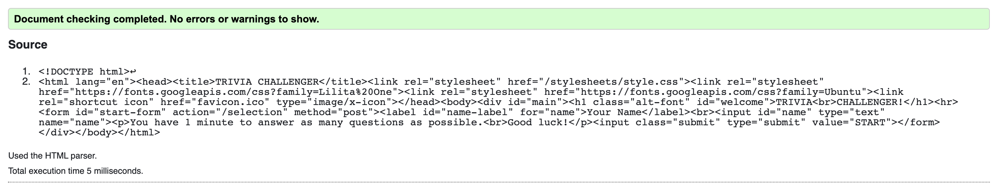
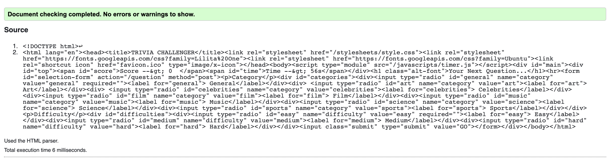
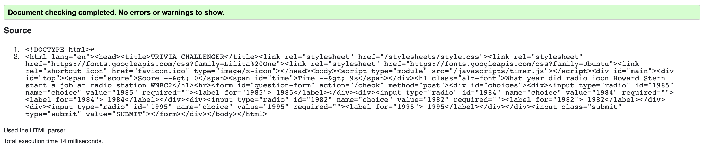
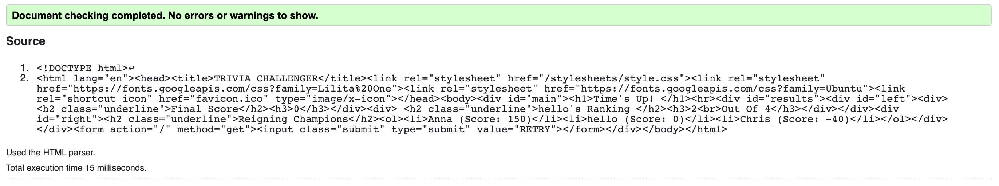

# Trivia Challenger

## Heroku Link
https://jaclynyfinalproject.herokuapp.com/ 
## Video Links
https://drive.google.com/file/d/1hW22KzjkpIm0uh3T9PbKLTdXw4VJLPpu/view?usp=drivesdk 
## Description
An extensive description of how your application address the core requirement of "It should do something that others could find useful, entertaining, informative, or of some other value" as specified in the original assignment overview.
## Client-Side and Server-Side
An in-dept explanation of what parts of your program are client-side and what parts of server-side.
## APIs and Contributed Modules
A clear and exhaustive detailing of at least one of the following as it is used in your app:
Accessing one or more 3rd-party web services
Coordinating live collaboration with other users (socket.io)
Visualizing complex datasets (D3)
Interacting with some physical (IoT) device
## MVC
Demonstrate good separation of concerns with an MVC architectural style by identifying and describing each aspect as it relates to your app.
## Cookies
One way my application uses cookies is to help store information that is needed by multiple different requests in the index.js file. For example, the /question post request retrieves the difficulty selection from the user and the correct answer from the API. However, both pieces of information are needed later in the /check post request to check whether the player's answer choice was correct and update their score accordingly. Using cookies eliminates the need for multiple global variables. A cookie is also used to power the coundown timer functionality of the application. The server-side dictates the amount of time to begin with and passes the time remaining to other pages when they render. The client-side code does the actual countdown using a setInterval function and updates the HTML every second to show the new amount of time remaining. In order for the server and client to communicate properly and display the time remaining across different pages with consistency, a cookie is used to that they can both read and write to it. 
## Database
The application I built relies on the database for storing all past players and their scores. Each document in the database is actually identified by the name of the player. I did this so that the player name would function somewhat similarly to a username (true account/username authentication was not implemented). Whenever a player plays, their score is updated to their new current score if they already exist in the database. Otherwise, a new record is inserted for the player. These pieces of information are stored in order to help determine how the player currently ranks againt everyone who has played in the past. By sorting the documents by their score, the application can calculate the rank of the given player based on where they appear. Counting all the documents helps determine the total number of players for better ranking context. Lastly, the database also makes it possible to display the current reigning champions and how well they scored by sorting and limiting the documents. This provides information for people curious in knowing how well they need to score in order to reach the top.
## HTML Validation

